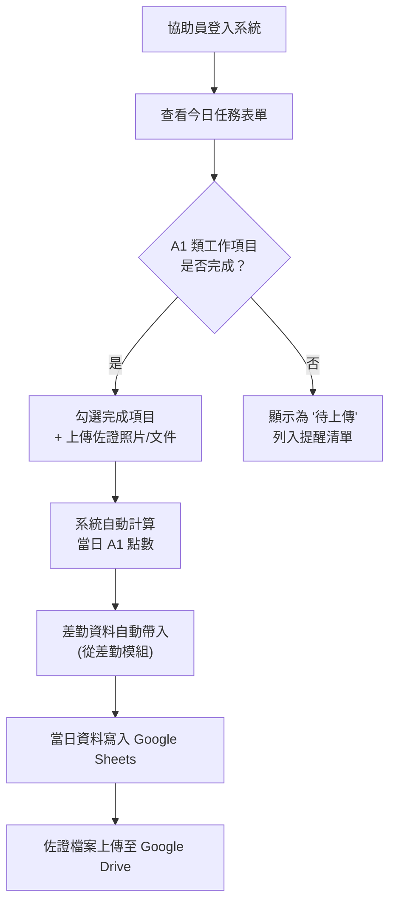
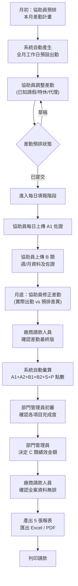
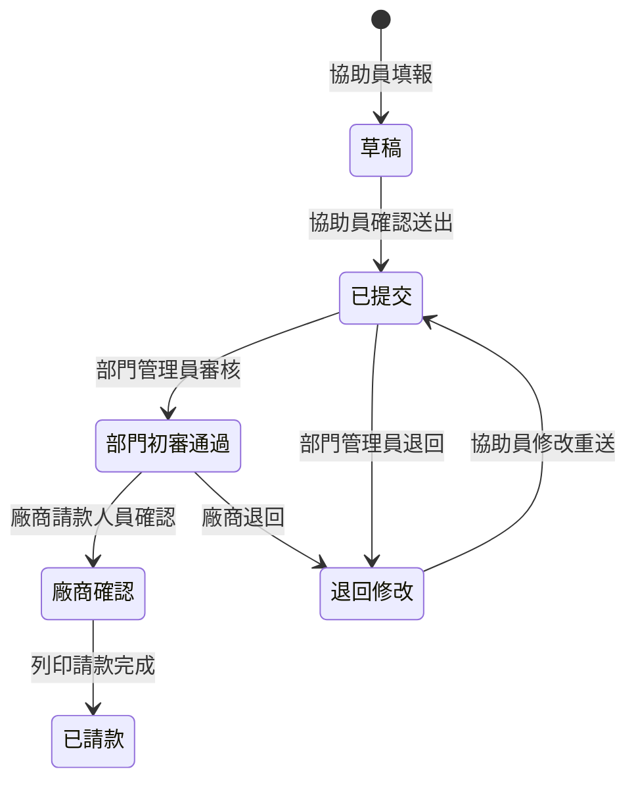
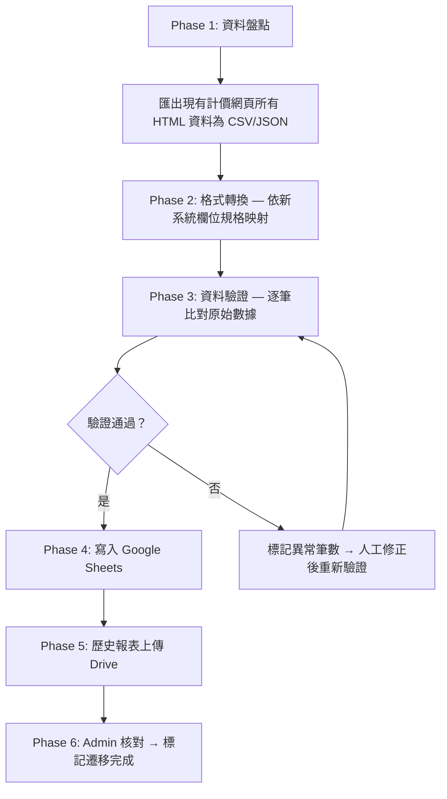

# 協助員點數管理系統｜OpenSpec 系統規格書 v3.0（統整版＋claude.md）

# 系統概覽

| **項目** | **說明** |
| --- | --- |
| 系統名稱 | 115年度 綜合施工處職安環保協助員點數管理系統 |
| 目標 | 取代現有單機計價網頁，建立多人線上協作系統，**透過 Google Drive 上傳佐證資料來確認協助員可請款之點數**，實現差勤管理、點數核算與請款流程 |
| 技術棧 | 前端 React（GitHub Pages 部署）／後端 Google Apps Script (GAS)／資料庫 Google Sheets／檔案儲存 Google Drive |
| 使用人數 | 約 20 人 |
| 驗證方式 | Google OAuth + 簡易密碼驗證（雙軌並行） |
| 版本差異 | 本版（v3.0）為 **統整定稿版**，整合 v1.0 基礎架構、v2.0 中文欄位與優化建議、補充規格書（登入/通知/遷移/佐證格式/RWD）為單一文件，並新增 [**claude.md](http://claude.md) AI 開發規則**章節 |

---

# ⭐ 最高指導原則

<aside>
🚨

**本系統開發與維護必須嚴格遵守以下原則：**

1. **依據官方身分名稱與工作項目名稱**：所有界面、資料庫、報表必須使用本規格書「點數定義表」中規定的四種身分名稱（一般工地協助員、離島工地協助員、職安業務兼管理員、環保業務人員）及完整工作項目名稱，不得自行簡化或改寫。
2. **參考計價網頁操作流程**：系統功能設計與使用者介面應參考現有計價網頁的操作邏輯與版面配置，確保使用者可無縫遷移。
3. **核心目的**：本系統之目的為協助員**透過 Google Drive 上傳佐證資料**，經審核流程確認後，依據點數定義表計算可請款之點數金額。
4. **點數不得任意修改**：各工作項目點數均依契約定義，僅 Admin 可透過系統設定介面調整，且變更歷程須留存於審核紀錄。
</aside>

---

# 1｜角色與權限矩陣

## 1.1 角色定義

| **角色** | **對應人員** | **說明** |
| --- | --- | --- |
| 🔴 管理者 (Admin) | 工安組人員 | 全案最高權限，可管理所有人員、所有資料、所有報表 |
| 🟠 部門管理員 (DeptMgr) | 各工作隊指定人員 | 只能看到 & 管理自己部門所屬的協助員，負責初審 & 績效評核 |
| 🟡 廠商請款人員 (Billing) | 廠商負責請款的人 | 確認全案差勤與點數正確性，執行最終列印請款 |
| 🟢 協助員 (Worker) | 各工地協助員 | 只能看到自己的資料，每日上傳佐證 & 填報點數 |

## 1.2 權限矩陣

| **功能** | **管理者** | **部門管理員** | **廠商請款** | **協助員** |
| --- | --- | --- | --- | --- |
| 使用者管理（新增/刪除/修改） | ✅ | ❌ | ❌ | ❌ |
| 查看所有人員資料 | ✅ | ❌ 僅本部門 | ✅ 唯讀 | ❌ 僅自己 |
| 差勤填寫 | ✅ 可代填 | ❌ | ✅ 確認 | ✅ 自行填寫 |
| 每日佐證資料上傳 | ✅ 可代傳 | ✅ 查看本部門 | ✅ 查看全案 | ✅ 僅自己 |
| A1 點數（每日） | ✅ 全部 | ✅ 本部門 | ✅ 查看/確認 | ✅ 自己上傳 |
| B 類點數（週/月） | ✅ 全部 | ✅ 本部門 | ✅ 查看/確認 | ✅ 自己上傳 |
| C 類績效評核金額 | ✅ 覆核 | ✅ 決定金額 | ✅ 確認 | ❌ 僅查看結果 |
| S 類特休代付 | ✅ | ✅ 查看 | ✅ 確認 | ❌ 自動帶入 |
| D1 類環保每日項目（環保專屬） | ✅ 全部 | ✅ 本部門 | ✅ 查看/確認 | ✅ 自己上傳 |
| D2 類環保週/月項目（環保專屬） | ✅ 全部 | ✅ 本部門 | ✅ 查看/確認 | ✅ 自己上傳 |
| P 類懲罰性違約金 | ✅ 設定 | ❌ | ✅ 確認 | ❌ 僅查看 |
| 報表查看 / 匯出 / 列印 | ✅ 全部 | ✅ 本部門 | ✅ 全案 | ❌ 僅自己摘要 |
| 最終確認 & 列印請款 | ✅ | ❌ | ✅ | ❌ |

---

# 2｜核心業務流程

## 2.1 每日流程（Daily）



## 2.2 每月流程（Monthly）



## 2.3 審核狀態機



---

# 3｜資料模型（Google Sheets 架構）— 繁體中文版

<aside>
📌

所有分頁名稱與欄位名稱全面使用繁體中文，方便非技術人員直接閱讀 Google Sheets 原始資料。英文代碼僅保留於列舉值（ENUM）內部，以確保程式端一致性。

</aside>

## 3.1 Sheet 總覽

| **#** | **分頁名稱（中文）** | **原英文名稱** | **用途** |
| --- | --- | --- | --- |
| 0 | `系統設定` | Config | 全域設定（公司名稱、契約期間、總人數、總月數、國定假日表） |
| 1 | `人員資料` | Users | 人員資料庫（姓名、角色、部門、職務類型、到職日、過往年資、帳號、密碼雜湊、最後登入時間） |
| 2 | `差勤紀錄` | Attendance | 每日差勤紀錄（人員ID、日期、上午狀態、下午狀態、備註） |
| 3 | `每日點數` | DailyPoints | 每日點數明細（人員ID、日期、項目編號、完成數量、佐證檔案ID、狀態） |
| 4 | `每月點數` | MonthlyPoints | 每月 B/C 類點數明細（人員ID、年月、項目編號、完成數量、佐證檔案ID、績效等級、狀態） |
| 5 | `審核紀錄` | ReviewLog | 審核紀錄（人員ID、年月、審核者、動作、時間戳、備註、變更明細） |
| 6 | `點數定義` | PointsConfig | 點數定義表（職務類型、項目編號、類別、名稱、單位點數、備註） |
| 7 | `檔案索引` | FilesIndex | Google Drive 檔案索引（檔案ID、人員ID、日期、項目編號、檔案名稱、上傳時間） |
| 8 | `月結快照` | MonthlySnapshot | 🆕 v3.0 新增：月底請款時自動產生彙算結果快照，鎖定不可修改 |
| 9 | `操作日誌` | ActivityLog | 🆕 v3.0 新增：記錄所有使用者的系統操作（登入、查詢、匯出、上傳等） |

## 3.2 `人員資料` 分頁欄位

| **#** | **欄位名稱** | **型別** | **說明** |
| --- | --- | --- | --- |
| A | 人員編號 | TEXT | 唯一識別碼（UUID 或遞增 ID） |
| B | 姓名 | TEXT | 人員姓名 |
| C | 電子信箱 | TEXT | Google 帳號 email（用於 OAuth 登入比對） |
| D | 密碼雜湊 | TEXT | 簡易密碼的雜湊值（備用登入） |
| E | 角色 | ENUM | admin | deptMgr | billing | worker |
| F | 所屬部門 | TEXT | 所屬部門（土木工作隊、建築工作隊…） |
| G | 服務區域 | TEXT | 服務區域（大潭、處本部…） |
| H | 職務類型 | ENUM | general | offshore | safety | environment
對應顯示：一般工地協助員 | 離島工地協助員 | 職安業務兼管理員 | 環保業務人員 |
| I | 到職日 | DATE | 現職到職日 |
| J | 過往年資天數 | NUMBER | 過往累計年資天數 |
| K | 是否啟用 | BOOLEAN | 是否啟用 |
| L | 建立時間 | DATETIME | 建立時間 |
| M | 最後登入時間 | DATETIME | 最近一次成功登入的時間戳 |
| N | 登入方式 | TEXT | 最近一次登入使用的方式（google | password） |

## 3.3 `差勤紀錄` 分頁欄位

| **#** | **欄位名稱** | **型別** | **說明** |
| --- | --- | --- | --- |
| A | 人員編號 | TEXT | 對應 人員資料.人員編號 |
| B | 日期 | DATE | 日期 (YYYY-MM-DD) |
| C | 上午狀態 | TEXT | 上午狀態（／、特N、病N、事N、代_姓名、曠、空白…） |
| D | 下午狀態 | TEXT | 下午狀態（同上） |
| E | 有效工時 | NUMBER | 系統自動計算的有效工時 |
| F | 特休時數 | NUMBER | 特休時數（自動計算） |
| G | 資料來源 | ENUM | planned | actual | auto | migrated |
| H | 是否鎖定 | BOOLEAN | FALSE = 可修改 | TRUE = 廠商已確認（鎖定） |
| I | 備註 | TEXT | 備註（如：月底修正原因） |
| J | 最後更新時間 | DATETIME | 最後更新時間 |

<aside>
📌

**差勤預排機制說明**

1. **月初預排**：系統自動為每位協助員產生當月所有工作日的差勤紀錄（資料來源=auto，上午狀態=／，下午狀態=／），週末/國定假日不產生。
2. **協助員調整**：協助員可修改預排（如已知特休、請假、代理），資料來源變為 planned。
3. **月底修正**：協助員核對實際出勤與預排的差異，修正後資料來源變為 actual。
4. **廠商確認**：廠商請款人員確認後，是否鎖定=TRUE，差勤鎖定不可再修改。
5. **差勤代碼標準化**：前端使用下拉選單（出勤、特休、病假、事假、代理、曠職、公假）取代自由文字，寫入 Sheet 統一格式如 `特4`、`代_王小明`、`病4`。
</aside>

## 3.4 `每日點數` 分頁欄位

| **#** | **欄位名稱** | **型別** | **說明** |
| --- | --- | --- | --- |
| A | 紀錄編號 | TEXT | 紀錄唯一 ID |
| B | 人員編號 | TEXT | 對應 人員資料.人員編號 |
| C | 日期 | DATE | 日期 |
| D | 項目編號 | TEXT | 對應 點數定義.項目編號 |
| E | 完成數量 | NUMBER | 完成數量（A1 類通常為 1＝當日有出勤） |
| F | 點數 | NUMBER | 系統自動計算的點數 |
| G | 佐證檔案編號 | TEXT | 佐證檔案 ID（逗號分隔，對應 Google Drive） |
| H | 狀態 | ENUM | draft | submitted | approved | rejected | migrated |
| I | 上傳時間 | DATETIME | 上傳時間 |
| J | 最後更新時間 | DATETIME | 最後修改時間 |

## 3.5 `每月點數` 分頁欄位

| **#** | **欄位名稱** | **型別** | **說明** |
| --- | --- | --- | --- |
| A | 紀錄編號 | TEXT | 紀錄唯一 ID |
| B | 人員編號 | TEXT | 對應 人員資料.人員編號 |
| C | 年月 | TEXT | 格式 YYYY-MM |
| D | 項目編號 | TEXT | 對應 點數定義.項目編號 |
| E | 完成數量 | NUMBER | 完成數量 |
| F | 點數 | NUMBER | 系統自動計算的點數 |
| G | 佐證檔案編號 | TEXT | 佐證檔案 ID（逗號分隔） |
| H | 績效等級 | TEXT | 僅 C 類使用（優 / 佳 / 平） |
| I | 狀態 | ENUM | draft | submitted | approved | rejected | migrated |
| J | 上傳時間 | DATETIME | 上傳時間 |
| K | 最後更新時間 | DATETIME | 最後修改時間 |

## 3.6 `審核紀錄` 分頁欄位

| **#** | **欄位名稱** | **型別** | **說明** |
| --- | --- | --- | --- |
| A | 紀錄編號 | TEXT | 審核紀錄唯一 ID |
| B | 人員編號 | TEXT | 被審核的協助員 |
| C | 年月 | TEXT | 審核對應的年月 |
| D | 審核者編號 | TEXT | 執行審核的人員編號 |
| E | 審核動作 | TEXT | submit | approve | reject | finalize | pointsConfigChange | migrate |
| F | 時間戳 | DATETIME | 審核執行時間 |
| G | 備註 | TEXT | 審核備註（退回原因、變更說明等） |
| H | 變更明細 | TEXT | 🆕 JSON 格式 before/after 差異紀錄 |

## 3.7 `點數定義` 分頁欄位

| **#** | **欄位名稱** | **型別** | **說明** |
| --- | --- | --- | --- |
| A | 項目編號 | TEXT | 項目唯一編號（如 GEN-A1-01） |
| B | 職務類型 | ENUM | general | offshore | safety | environment |
| C | 類別 | TEXT | A1 | A2 | B1 | B2 | C | D1 | D2 | S | P |
| D | 工作項目名稱 | TEXT | 工作項目名稱 |
| E | 單位點數 | NUMBER | 每單位點數 |
| F | 計量單位 | TEXT | 計量單位（天、次、小時、月） |
| G | 頻率 | TEXT | daily | monthly | yearly | event |
| H | 備註 | TEXT | 備註（如 C 類的優/佳/平金額） |

## 3.8 `檔案索引` 分頁欄位

| **#** | **欄位名稱** | **型別** | **說明** |
| --- | --- | --- | --- |
| A | 檔案編號 | TEXT | 檔案唯一 ID |
| B | 人員編號 | TEXT | 上傳者的人員編號 |
| C | 日期 | DATE | 佐證對應日期 |
| D | 項目編號 | TEXT | 佐證對應的工作項目 |
| E | 檔案名稱 | TEXT | 原始檔案名稱 |
| F | 檔案類型 | TEXT | MIME type（image/jpeg, application/pdf…） |
| G | 雲端檔案編號 | TEXT | Google Drive 檔案 ID |
| H | 上傳時間 | DATETIME | 檔案上傳時間 |

## 3.9 🆕 `月結快照` 分頁欄位

<aside>
💡

在「廠商確認」階段自動產生該月每位協助員的彙算結果快照，並鎖定不可修改。報表直接從快照讀取，確保報表金額可追溯、不可竄改，並大幅加速報表產出。

</aside>

| **#** | **欄位名稱** | **型別** | **說明** |
| --- | --- | --- | --- |
| A | 快照編號 | TEXT | 唯一 ID |
| B | 人員編號 | TEXT | 對應人員 |
| C | 年月 | TEXT | YYYY-MM |
| D | A類小計 | NUMBER | A1+A2 合計點數 |
| E | B類小計 | NUMBER | B1+B2 合計點數 |
| F | C類金額 | NUMBER | 績效評核金額 |
| G | D類小計 | NUMBER | D1+D2 合計（環保專屬） |
| H | S類金額 | NUMBER | 特休代付 |
| I | P類扣款 | NUMBER | 違約金扣款 |
| J | 本月總計 | NUMBER | 淨請款點數 |
| K | 出勤天數 | NUMBER | 實際出勤天數 |
| L | 特休時數 | NUMBER | 當月特休時數 |
| M | 快照時間 | DATETIME | 快照產生時間 |
| N | 確認者編號 | TEXT | 廠商請款人員編號 |

## 3.10 🆕 `操作日誌` 分頁欄位

| **#** | **欄位名稱** | **型別** | **說明** |
| --- | --- | --- | --- |
| A | 日誌編號 | TEXT | 唯一 ID |
| B | 人員編號 | TEXT | 操作者人員編號 |
| C | 操作時間 | DATETIME | 操作時間戳 |
| D | 操作類型 | TEXT | login | logout | query | export | upload | update | delete | review |
| E | 操作說明 | TEXT | 操作詳細描述 |

## 3.11 `系統設定` 分頁欄位

| **#** | **欄位名稱** | **型別** | **說明** |
| --- | --- | --- | --- |
| A | 設定鍵 | TEXT | 設定項目的 key |
| B | 設定值 | TEXT | 設定項目的 value |
| C | 備註 | TEXT | 設定說明 |

## 3.12 Google Drive 資料夾結構

```jsx
📁 115年度_點數管理系統/
├── 📁 佐證資料/
│   ├── 📁 {年月}/
│   │   ├── 📁 {人員姓名}_{人員編號}/
│   │   │   ├── 📁 A1_每日/
│   │   │   │   ├── 20260401_巡檢紀錄.jpg
│   │   │   │   └── 20260401_危害告知.pdf
│   │   │   ├── 📁 B1_月報/
│   │   │   │   └── 設備稽核報告.pdf
│   │   │   └── ...
│   │   └── ...
│   └── ...
├── 📁 匯出報表/
│   ├── 📁 {年月}/
│   │   ├── 差勤統計表_202601.xlsx
│   │   ├── 工作月報表_王小明_202601.xlsx
│   │   └── ...
│   └── ...
└── 📁 系統備份/
```

---

# 4｜前端頁面架構（React）

## 4.1 路由規劃

| **路由** | **頁面** | **可存取角色** |
| --- | --- | --- |
| `/login` | 登入頁 | 所有人（Google OAuth + 帳號密碼雙軌） |
| `/dashboard` | 儀表板首頁 | 所有人（依角色顯示不同內容） |
| `/daily` | 每日填報 & 任務清單 | Worker、Admin |
| `/daily/:userId/:date` | 單日佐證上傳 | Worker（自己）、Admin |
| `/attendance` | 差勤管理 | Worker（自己）、Billing（確認）、Admin |
| `/monthly/:yearMonth` | 月報填報 | Worker、DeptMgr、Admin |
| `/review` | 審核中心 | DeptMgr、Billing、Admin |
| `/reports` | 報表中心 | DeptMgr（本部門）、Billing、Admin |
| `/admin/users` | 使用者管理 | Admin |
| `/admin/config` | 系統設定 | Admin |
| `/admin/migrate` | 🆕 資料遷移 | Admin |
| `/admin/notifications` | 🆕 通知管理 | Admin |

## 4.2 關鍵頁面功能說明

### 4.2.1 登入頁 `/login`

- **Google 登入按鈕**：使用 Google Identity Services SDK
- **帳號密碼表單**：Email + 密碼輸入框（備用方式）
- **Session 管理**：UUID v4 Token，CacheService 存放，30 分鐘有效期，每次 API 呼叫自動延長

### 4.2.2 協助員儀表板 `/dashboard`（Worker 視角）

- **今日任務卡片**：顯示今天需上傳的 A1 項目清單，已上傳打 ✅、未上傳打 ⏳
- **本月進度條**：顯示本月各類別點數完成百分比
- **待辦提醒**：列出尚未上傳佐證的日期 & 項目（紅色標記逾期）
- **本月累計點數摘要**：A 類 / B 類 / C 類 / S 類 / 總計

### 4.2.3 每日填報 `/daily`（Worker 視角）

- **手機版**：滑動式週視圖月曆，點選日期展開 A1 項目卡片
- **桌面版**：左側完整月曆 + 右側項目清單 & 佐證上傳區
- 每個項目可以：勾選完成、上傳多筆佐證（照片/PDF）、修改已上傳的佐證、加入備註
- **拍照上傳**：手機直接呼叫相機 API，自動壓縮至 1920px / 80% 品質

### 4.2.4 審核中心 `/review`

- **部門管理員**：本部門協助員月報、逐項確認、設定 C 類績效等級與金額、初審通過或退回
- **廠商請款人員**：全案已通過初審的月報、確認差勤 & 點數、確認請款→解鎖報表列印

### 4.2.5 報表中心 `/reports`

5 張報表（與現有系統一致）：

1. **差勤統計表**（橫式，每人一頁）
2. **工作月報表**（橫式，每人一頁）
3. **每月工作量彙總表**（直式，全案一頁）
4. **人員出勤暨特休統計表**（橫式，全案一頁）
5. **每月服務費統計表**（直式，全案一頁）

每張報表支援：📊 線上預覽、📥 匯出 Excel（SheetJS）、🖨️ 列印 / 匯出 PDF

---

# 5｜自動計算邏輯

## 5.1 A1 點數（每日）

```jsx
A1 每日點數 = Σ (各 A1 項目點數) × (當日出勤狀態)

出勤狀態判定：
- 全天出勤（上午＋下午皆 ／）→ 計 1 天
- 半天出勤（上午或下午其中一個 ／）→ 計 0.5 天（各項 A1 × 0.5）
- 全天請假 / 缺勤 → 計 0 天（不給 A1）
- 緩衝期（一般前 2 天 / 離島前 3 天連續缺勤）→ 不給 A1 但不計罰
```

## 5.2 S 類特休代付款（自動）

```jsx
S 點數 = 特休時數 × 單位點數

特休時數自動從「差勤紀錄」分頁彙算：
- 掃描當月所有出勤紀錄中「上午狀態」/「下午狀態」含「特」的欄位
- 特 = 4 小時、特N = N 小時
- 加總得到本月特休總時數
```

## 5.3 P 類懲罰性違約金（自動）

```jsx
連續缺勤計算：
1. 掃描當月工作日（排除週末 & 國定假日）
2. 若某工作日上午＋下午皆無出勤 → 連續缺勤天數 + 1
3. 出勤（含代理）→ 連續缺勤歸零

罰款邏輯：
- 一般 / 職安 / 環保：連續缺勤 > 2 天 → 第 3 天起每天罰 8h × 單位點數
- 離島：連續缺勤 > 3 天 → 第 4 天起每天罰 8h × 單位點數
```

## 5.4 雇主固定費用 & 行政管理費（服務費統計表）

```jsx
人數比例 = 本月實際人數 ÷ 全案總人數（11人），四捨五入至小數第 2 位
雇主固定費用 = 契約金額 ÷ 總月數 × 人數比例

出勤率 = 所有人員實際上班總天數 ÷ (全案總人數 × 當月工作日數)
行政管理費用 = 契約金額 ÷ 總月數 × 出勤率

含稅金額 = (計一 + 計二 + 計三 - 扣款) × 1.05
```

---

# 6｜GAS API 端點設計（完整版）

| **方法** | **端點** | **說明** |
| --- | --- | --- |
| **登入驗證** |  |  |
| POST | `/auth/login` | 登入（支援 `{type:'google', idToken}` 或 `{type:'password', email, password}`） |
| GET | `/auth/me` | 取得當前登入者資訊 |
| POST | `/auth/logout` | 登出（清除 CacheService session） |
| **使用者管理** |  |  |
| GET | `/users` | 取得使用者列表（Admin: 全部 / DeptMgr: 本部門） |
| POST | `/users` | 新增使用者（Admin only） |
| PUT | `/users/:id` | 修改使用者（Admin only） |
| DELETE | `/users/:id` | 刪除使用者（Admin only） |
| **差勤管理** |  |  |
| GET | `/attendance/:userId/:yearMonth` | 取得某人某月差勤 |
| PUT | `/attendance/:userId/:date` | 更新差勤（Worker: 自己 / Billing: 確認） |
| POST | `/attendance/generate/:yearMonth` | 產生某月全員預排差勤（Admin only） |
| POST | `/attendance/finalize/:yearMonth` | 廠商確認鎖定某月全員差勤（Billing / Admin） |
| **點數管理** |  |  |
| GET | `/points/daily/:userId/:yearMonth` | 取得某人某月每日點數明細 |
| POST | `/points/daily` | 新增/更新每日點數紀錄 |
| POST | `/points/daily/batch` | 🆕 批次提交多筆當日點數 + 佐證 |
| GET | `/points/monthly/:userId/:yearMonth` | 取得某人某月 B/C 類明細 |
| POST | `/points/monthly` | 新增/更新月報點數紀錄 |
| GET | `/points/config` | 取得點數定義表 |
| **審核流程** |  |  |
| POST | `/review/approve` | 審核通過（DeptMgr / Billing） |
| POST | `/review/reject` | 退回修改 |
| **報表 & 檔案** |  |  |
| GET | `/reports/:type/:yearMonth` | 取得報表資料（type: 1~5） |
| POST | `/files/upload` | 上傳佐證檔案至 Google Drive（僅 PDF/JPG/PNG） |
| GET | `/files/:fileId` | 取得檔案下載連結 |
| **系統管理** |  |  |
| GET | `/config` | 取得系統設定 |
| PUT | `/config` | 更新系統設定（Admin only） |
| POST | `/system/init` | 自動初始化 Sheets + Drive（Admin only） |
| POST | `/system/seed-points` | 寫入點數定義種子資料（Admin only） |
| **🆕 通知管理** |  |  |
| GET | `/notifications/status` | 查看通知設定狀態（Admin only） |
| PUT | `/notifications/config` | 更新通知設定（Admin only） |
| POST | `/notifications/test` | 發送測試通知信（Admin only） |
| **🆕 資料遷移** |  |  |
| POST | `/system/migrate/users` | 批次匯入人員資料（Admin only） |
| POST | `/system/migrate/attendance` | 批次匯入歷史差勤（Admin only） |
| POST | `/system/migrate/daily-points` | 批次匯入歷史每日點數（Admin only） |
| POST | `/system/migrate/monthly-points` | 批次匯入歷史每月點數（Admin only） |
| POST | `/system/migrate/validate` | 驗證遷移資料完整性（Admin only） |

---

# 7｜GAS 單一檔案架構（[Code.gs](http://Code.gs)）

<aside>
📌

所有 GAS 程式碼統一寫在**單一 `Code.gs` 檔案**中，以區塊註解分隔各功能模組，方便維護與部署。

</aside>

```jsx
// ====================================================
// Code.gs — 協助員點數管理系統 v3.0
// 所有功能統一於此檔案，以區塊註解分隔
// ====================================================

// ========== [常數定義] ==========
// SHEETS 分頁名稱常數、COLUMNS 欄位名稱常數

// ========== [路由分發] doGet / doPost ==========
// 處理所有 HTTP 請求的入口

// ========== [系統初始化] ==========
// initSystem()：建立 10 張中文分頁 + Drive 資料夾 + 點數種子 + 通知觸發器

// ========== [登入驗證] ==========
// Google OAuth + 帳號密碼雙軌驗證、Session 管理

// ========== [使用者管理] ==========
// 使用者 CRUD

// ========== [差勤管理] ==========
// 差勤 CRUD + 預排/修正 + 自動計算 + 代碼標準化

// ========== [點數管理] ==========
// 點數 CRUD + 批次提交 + 自動計算

// ========== [審核流程] ==========
// 審核狀態機 + 月結快照產生

// ========== [報表彙算] ==========
// 5 張報表資料彙算（優先從月結快照讀取）

// ========== [檔案上傳] ==========
// Google Drive 上傳（含格式驗證 PDF/JPG/PNG only）

// ========== [Email 通知] ==========
// 每日/月底提醒 + 審核結果即時通知 + Admin 異常報告

// ========== [資料遷移] ==========
// 舊系統資料匯入工具 + 驗證

// ========== [操作日誌] ==========
// 記錄所有使用者操作

// ========== [系統設定] ==========
// 系統設定讀寫

// ========== [共用工具] ==========
// Sheet 操作、權限檢查、日期工具、密碼雜湊
```

---

# 8｜Email 通知系統

| **#** | **通知類型** | **觸發時間** | **頻率** | **收件對象** |
| --- | --- | --- | --- | --- |
| N1 | 每日未上傳點數提醒 | 每日下午 16:00 | 每工作日 | 當日有出勤但尚未上傳 A1 的協助員 |
| N2 | 每月未上傳月報提醒 | 每月 25 日 09:00 | 每月一次 | B 類點數尚未提交的協助員 |
| N3 | 下月出勤表填寫提醒 | 每月最後工作日 09:00 | 每月一次 | 尚未完成下月差勤預排的協助員 |
| N4 | 審核結果通知 | 審核動作觸發後即時 | 事件驅動 | 被審核的協助員（通過/退回） |
| N5 | Admin 異常報告 | 每日 08:00 | 每工作日 | Admin（連續缺勤預警、異常上傳等） |

**系統設定通知控制項：**

| **設定鍵** | **預設值** | **說明** |
| --- | --- | --- |
| notificationEnabled | TRUE | Email 通知總開關 |
| dailyReminderHour | 16 | 每日提醒時間（24 小時制） |
| monthlyReminderDay | 25 | 月報提醒日期 |
| systemUrl | (部署後填入) | 系統前端 URL |
| adminEmails | (Admin email) | 接收異常報告的管理員信箱 |

---

# 9｜佐證資料格式規範

<aside>
🚨

**所有佐證資料僅接受以下格式：**

- **PDF 文件**（application/pdf）
- **照片**（image/jpeg, image/png）
- **單檔上限 10MB**（GAS 限制）

其他格式將被系統前後端雙重拒絕上傳。

</aside>

**手機拍照上傳最佳化：**

- 使用 `<input type="file" accept="image/*" capture="environment">` 直接呼叫相機
- 自動壓縮：maxWidth 1920px / maxHeight 1920px / quality 80%
- 離線暫存：IndexedDB 暫存壓縮照片（最多 50MB），上線後批次上傳

---

# 10｜手機版優先 RWD 設計規範

<aside>
📱

**Mobile-First 原則**：所有頁面以手機螢幕（≤ 480px）為基礎設計，再向上適配平板與桌面。

</aside>

**斷點規劃：**

| **斷點** | **寬度** | **適用裝置** |
| --- | --- | --- |
| 📱 Mobile | ≤ 480px | 手機（**主要設計基準**） |
| 📱 Mobile L | 481–768px | 大螢幕手機 / 小平板 |
| 📱 Tablet | 769–1024px | 平板 |
| 💻 Desktop | ≥ 1025px | 桌面電腦 |

**觸控友善設計：**

- 最小觸控區域：44px × 44px
- 按鈕間距：至少 8px
- 輸入框高度：≥ 48px
- 字體大小：正文 ≥ 16px
- 支援左右滑動切換日期/月份

**PWA 配置：** 可安裝至手機桌面，含 manifest.json + Service Worker

---

# 11｜資料遷移計畫

<aside>
🚨

**核心原則**：遷移後的資料必須完整保留原有格式與數值，不得在遷移過程中修改任何點數、差勤或佐證資料。遷移完成後需經 Admin 逐月核對確認。

</aside>



**遷移資料標記：**

- 差勤紀錄：`資料來源` = `migrated`
- 每日/每月點數：`狀態` = `migrated`（視同 approved）
- 審核紀錄：自動產生 `{ 審核動作: 'migrate', 備註: '由舊系統遷移' }`

---

# 12｜GAS 自動初始化腳本規格

## 12.1 觸發與防重複

- **API 端點**：`POST /system/init`（Admin only）
- **防重複**：檢查「系統設定」分頁是否已存在 `isInitialized=TRUE`

## 12.2 系統設定預設值

| **設定鍵** | **設定值** | **備註** |
| --- | --- | --- |
| companyName | 網統施工處 | 公司名稱 |
| contractStart | 2026-01-01 | 契約開始日 |
| contractEnd | 2026-12-31 | 契約結束日 |
| totalWorkers | 11 | 全案總人數 |
| totalMonths | 12 | 全案總月數 |
| holidays2026 | 1-1,2-16,2-17,2-18,2-19,2-20,2-27,4-3,4-6,5-1,6-19,9-25,10-9 | 115年國定假日 |
| driveFolderId | (自動填入) | 根資料夾 ID |
| isInitialized | TRUE | 防重複初始化旗標 |
| notificationEnabled | TRUE | Email 通知總開關 |
| dailyReminderHour | 16 | 每日提醒時間 |
| monthlyReminderDay | 25 | 月報提醒日期 |
| systemUrl | (部署後填入) | 系統前端 URL |
| adminEmails | (Admin email) | 異常報告收件者 |

## 12.3 初始化建立的分頁標頭

| **#** | **分頁名稱** | **第 1 列標頭** |
| --- | --- | --- |
| 0 | `系統設定` | 設定鍵, 設定值, 備註 |
| 1 | `人員資料` | 人員編號, 姓名, 電子信箱, 密碼雜湊, 角色, 所屬部門, 服務區域, 職務類型, 到職日, 過往年資天數, 是否啟用, 建立時間, 最後登入時間, 登入方式 |
| 2 | `差勤紀錄` | 人員編號, 日期, 上午狀態, 下午狀態, 有效工時, 特休時數, 資料來源, 是否鎖定, 備註, 最後更新時間 |
| 3 | `每日點數` | 紀錄編號, 人員編號, 日期, 項目編號, 完成數量, 點數, 佐證檔案編號, 狀態, 上傳時間, 最後更新時間 |
| 4 | `每月點數` | 紀錄編號, 人員編號, 年月, 項目編號, 完成數量, 點數, 佐證檔案編號, 績效等級, 狀態, 上傳時間, 最後更新時間 |
| 5 | `審核紀錄` | 紀錄編號, 人員編號, 年月, 審核者編號, 審核動作, 時間戳, 備註, 變更明細 |
| 6 | `點數定義` | 項目編號, 職務類型, 類別, 工作項目名稱, 單位點數, 計量單位, 頻率, 備註 |
| 7 | `檔案索引` | 檔案編號, 人員編號, 日期, 項目編號, 檔案名稱, 檔案類型, 雲端檔案編號, 上傳時間 |
| 8 | `月結快照` | 快照編號, 人員編號, 年月, A類小計, B類小計, C類金額, D類小計, S類金額, P類扣款, 本月總計, 出勤天數, 特休時數, 快照時間, 確認者編號 |
| 9 | `操作日誌` | 日誌編號, 人員編號, 操作時間, 操作類型, 操作說明 |

---

# 13｜點數定義種子資料（完整 51 筆）

<aside>
⚠️

以下全部 51 筆點數定義為初始化種子資料的唯一正式來源。環保業務人員獨有 D1、D2 類別。C 類的單位點數存「優」等級金額，佳/平金額存於備註欄位。**不得任意修改。**

</aside>

## 13.1 一般工地協助員 (General)

| **項目編號** | **類別** | **工作項目名稱** | **點數** | **備註** |
| --- | --- | --- | --- | --- |
| GEN-A1-01 | A1 | 自動檢查與工地巡檢 | 800 |  |
| GEN-A1-03 | A1 | 承攬商每日作業安全循環之監督與協調 | 200 |  |
| GEN-A2-01 | A2 | 天然災害停止上班遠端作業(颱風假、豪雨假等) | 1400 |  |
| GEN-B1-02 | B1 | 設備設施安全稽核 | 3000 |  |
| GEN-B1-04 | B1 | 職安衛文書作業與水平展開 | 2900 |  |
| GEN-C-01 | C | 臨時交辦與績效 | 5000 | 優 5000 / 佳 3000 / 平 2000 |
| GEN-P-01 | P | 懲罰性違約金 (未派員履約) | 220 | 單位：小時 |

## 13.2 離島工地協助員 (Offshore)

| **項目編號** | **類別** | **工作項目名稱** | **點數** | **備註** |
| --- | --- | --- | --- | --- |
| OFF-A1-01 | A1 | 自動檢查與工地巡檢 | 1060 |  |
| OFF-A1-03 | A1 | 承攬商每日作業安全循環之監督與協調 | 300 |  |
| OFF-A2-01 | A2 | 天然災害停止上班遠端作業(颱風假、豪雨假等) | 1800 |  |
| OFF-B1-02 | B1 | 設備設施安全稽核 | 4000 |  |
| OFF-B1-04 | B1 | 職安衛文書作業與水平展開 | 3600 |  |
| OFF-C-01 | C | 臨時交辦與績效 | 7200 | 優 7200 / 佳 5200 / 平 4200 |
| OFF-P-01 | P | 懲罰性違約金 (未派員履約) | 290 | 單位：小時 |

## 13.3 職安業務兼管理員 (Safety)

| **項目編號** | **類別** | **工作項目名稱** | **點數** | **備註** |  |  |  |  |  |
| --- | --- | --- | --- | --- | --- | --- | --- | --- | --- |
| SAF-A1-01 | A1 | 確認協助員每日上傳狀況並追蹤 | 600 |  | SAF-A1-02 | A1 | 走動管理及工安查核追蹤 | 500 |  |
| SAF-A2-01 | A2 | 天然災害停止上班遠端作業(颱風假、豪雨假等) | 1000 |  | SAF-B1-01 | B1 | 缺失或宣導製作簡報 | 2000 |  |
| SAF-B1-02 | B1 | 職安類週/月/季及年報彙整 | 10800 |  | SAF-B1-03 | B1 | 職安管理系統文件統計分析 | 1000 |  |
| SAF-B1-04 | B1 | 廠商管理人每月計價作業 | 4500 |  | SAF-B1-05 | B1 | 出勤調度與差勤抽查 | 500 |  |
| SAF-B2-01 | B2 | 春節期間防護檢核資料彙整 | 4000 |  | SAF-C-01 | C | 臨時交辦與績效 | 5000 | 優 5000 / 佳 3000 / 平 2000 |
| SAF-S-01 | S | 特休代付款 | 200 | 單位：小時 | SAF-P-01 | P | 懲罰性違約金 (未派員履約) | 200 | 單位：小時 |

## 13.4 環保業務人員 (Environment)

| **項目編號** | **類別** | **工作項目名稱** | **點數** | **備註** |
| --- | --- | --- | --- | --- |
| ENV-A1-01 | A1 | 環保行政業務 | 500 |  |
| ENV-B1-01 | B1 | 行政文書核心 | 29500 |  |
| ENV-C-01 | C | 臨時交辦與績效 | 2000 | 優 2000 / 佳 1000 / 平 500 |
| ENV-D1-02 | D1 | 監督與量測計畫及實施 | 100 |  |
| ENV-D2-01 | D2 | 環境審查作業程序書作業 | 800 |  |
| ENV-D2-03 | D2 | 內部稽核文件整理準備 | 900 |  |
| ENV-P-01 | P | 懲罰性違約金 (未派員履約) | 190 | 單位：小時 |

---

# 14｜技術要點與限制

| **議題** | **對策** |
| --- | --- |
| GAS 執行時間限制（6 分鐘） | 報表優先從月結快照讀取；大量寫入使用批次 API；CacheService 快取已產出報表（10 分鐘 TTL） |
| Google Sheets 併發寫入 | 使用 LockService 避免衝突，先上傳 Drive 取得 fileId 再批次更新 Sheet |
| Google Sheets 單格 50,000 字元 | 佐證檔案存 Drive、只存 fileId 參照 |
| GitHub Pages 無 Server | 所有 API 由 GAS Web App 提供，React 為純前端 SPA |
| OAuth 安全性 | GAS 端驗證 Google ID Token，Session Token 存 CacheService（30 分鐘過期），每次 API 驗證 |
| 離線/網路不穩 | Service Worker + localStorage 草稿 + IndexedDB 暫存照片，上線後自動同步 |
| 檔案大小限制 | 單檔上限 10MB，前端自動壓縮圖片後上傳 |
| GAS Email 配額 | 使用 MailApp.sendEmail()，20 人規模每日約 20 封，配額充足 |

---

# 15｜開發階段規劃

| **階段** | **名稱** | **交付內容** | **工期** |
| --- | --- | --- | --- |
| Phase 0 | 基礎建設 | GAS [Code.gs](http://Code.gs) 初始化（10 張分頁 + Drive + 通知觸發器）、React + PWA + RWD 框架、GitHub Pages 部署、雙軌登入驗證 | 1.5 週 |
| Phase 1 | 使用者 & 差勤 | 使用者 CRUD、差勤填報（RWD 卡片式手機版）、代碼標準化下拉選單、自動計算、緩衝期/違約金邏輯 | 2 週 |
| Phase 2 | 每日點數 & 上傳 | 每日任務表單（手機週視圖月曆）、佐證上傳（PDF/照片格式驗證、拍照壓縮）、批次提交 API、A1 點數自動計算、離線草稿暫存 | 2.5 週 |
| Phase 3 | 月報 & 審核 | B/C 類月報填報、績效評核、審核流程（含變更明細紀錄）、月結快照產生 | 2 週 |
| Phase 4 | 報表 & 請款 | 5 張報表線上預覽（手機版橫向捲動）、從月結快照讀取、Excel/PDF 匯出、列印請款 | 2 週 |
| Phase 5 | 通知 & 遷移 | Email 通知系統（N1~N5）、資料遷移工具（/admin/migrate）、遷移 API 端點 | 1.5 週 |
| Phase 6 | 優化 & 上線 | 效能優化、RWD 微調、操作日誌、資料遷移執行與核對、UAT 測試 | 1.5 週 |

**總工期預估：約 13 週**

---

# 16｜中英文欄位常數速查表

```jsx
// Code.gs — 欄位名稱常數
const COLUMNS = {
  USERS: {
    ID: '人員編號', NAME: '姓名', EMAIL: '電子信箱',
    PASSWORD_HASH: '密碼雜湊', ROLE: '角色', DEPARTMENT: '所屬部門',
    AREA: '服務區域', WORKER_TYPE: '職務類型', ONBOARD_DATE: '到職日',
    PAST_EXP_DAYS: '過往年資天數', IS_ACTIVE: '是否啟用',
    CREATED_AT: '建立時間', LAST_LOGIN: '最後登入時間', LOGIN_METHOD: '登入方式',
  },
  ATTENDANCE: {
    USER_ID: '人員編號', DATE: '日期', AM_STATUS: '上午狀態',
    PM_STATUS: '下午狀態', WORK_HOURS: '有效工時', LEAVE_HOURS: '特休時數',
    SOURCE: '資料來源', IS_FINALIZED: '是否鎖定', NOTE: '備註',
    UPDATED_AT: '最後更新時間',
  },
  DAILY_POINTS: {
    RECORD_ID: '紀錄編號', USER_ID: '人員編號', DATE: '日期',
    ITEM_ID: '項目編號', QUANTITY: '完成數量', POINTS: '點數',
    FILE_IDS: '佐證檔案編號', STATUS: '狀態',
    UPLOADED_AT: '上傳時間', UPDATED_AT: '最後更新時間',
  },
  MONTHLY_POINTS: {
    RECORD_ID: '紀錄編號', USER_ID: '人員編號', YEAR_MONTH: '年月',
    ITEM_ID: '項目編號', QUANTITY: '完成數量', POINTS: '點數',
    FILE_IDS: '佐證檔案編號', PERF_LEVEL: '績效等級', STATUS: '狀態',
    UPLOADED_AT: '上傳時間', UPDATED_AT: '最後更新時間',
  },
  REVIEW_LOG: {
    LOG_ID: '紀錄編號', USER_ID: '人員編號', YEAR_MONTH: '年月',
    REVIEWER_ID: '審核者編號', ACTION: '審核動作', TIMESTAMP: '時間戳',
    NOTE: '備註', CHANGE_DETAIL: '變更明細',
  },
  POINTS_CONFIG: {
    ITEM_ID: '項目編號', WORKER_TYPE: '職務類型', CATEGORY: '類別',
    NAME: '工作項目名稱', POINTS_PER_UNIT: '單位點數', UNIT: '計量單位',
    FREQUENCY: '頻率', NOTE: '備註',
  },
  FILES_INDEX: {
    FILE_ID: '檔案編號', USER_ID: '人員編號', DATE: '日期',
    ITEM_ID: '項目編號', FILE_NAME: '檔案名稱', MIME_TYPE: '檔案類型',
    DRIVE_FILE_ID: '雲端檔案編號', UPLOADED_AT: '上傳時間',
  },
  MONTHLY_SNAPSHOT: {
    SNAPSHOT_ID: '快照編號', USER_ID: '人員編號', YEAR_MONTH: '年月',
    A_TOTAL: 'A類小計', B_TOTAL: 'B類小計', C_AMOUNT: 'C類金額',
    D_TOTAL: 'D類小計', S_AMOUNT: 'S類金額', P_DEDUCTION: 'P類扣款',
    MONTH_TOTAL: '本月總計', WORK_DAYS: '出勤天數', LEAVE_HOURS: '特休時數',
    SNAPSHOT_TIME: '快照時間', CONFIRMER_ID: '確認者編號',
  },
  ACTIVITY_LOG: {
    LOG_ID: '日誌編號', USER_ID: '人員編號', TIMESTAMP: '操作時間',
    ACTION_TYPE: '操作類型', DESCRIPTION: '操作說明',
  },
  CONFIG: { KEY: '設定鍵', VALUE: '設定值', NOTE: '備註' },
};

const SHEETS = {
  CONFIG: '系統設定', USERS: '人員資料', ATTENDANCE: '差勤紀錄',
  DAILY_POINTS: '每日點數', MONTHLY_POINTS: '每月點數',
  REVIEW_LOG: '審核紀錄', POINTS_CONFIG: '點數定義',
  FILES_INDEX: '檔案索引', MONTHLY_SNAPSHOT: '月結快照',
  ACTIVITY_LOG: '操作日誌',
};
```

---

# 17｜🤖 [claude.md](http://claude.md) — AI 開發規則

<aside>
🤖

以下為本專案的 **AI 開發助手規則檔**（`claude.md`），任何 AI 工具（Claude、ChatGPT、Cursor 等）在參與本專案開發時，**必須先讀取並遵守此規則**。將此內容存為專案根目錄的 `claude.md` 檔案。

</aside>

```markdown
# claude.md — 協助員點數管理系統 AI 開發規則

## 📋 專案概覽

- **專案名稱**：115年度 綜合施工處職安環保協助員點數管理系統
- **技術棧**：React (GitHub Pages) + Google Apps Script (GAS) + Google Sheets + Google Drive
- **規格書**：OpenSpec v3.0（本規格書為唯一正式來源）
- **語言**：繁體中文（程式碼註解、Git commit、PR 描述皆使用繁體中文）

---

## 🚨 最高優先規則（違反即退回）

1. **點數定義不可更改**：51 筆點數定義（13.1~13.4）的項目編號、名稱、點數值均為契約內容，任何程式碼不得硬編碼修改這些數值。僅 Admin 可透過系統設定介面調整，且必須留存審核紀錄。

2. **四種身分名稱必須完整**：一般工地協助員、離島工地協助員、職安業務兼管理員、環保業務人員。不得自行簡化為「一般」、「離島」等縮寫。UI 顯示時必須使用完整名稱。

3. **工作項目名稱必須完整**：如「危害告知與高風險作業管制與監督」，不得簡化為「危害告知」。

4. **Google Sheets 欄位名稱使用繁體中文**：所有分頁名稱與欄位標頭必須使用 COLUMNS / SHEETS 常數中定義的繁體中文名稱，程式碼中透過常數引用，不得硬編碼中文字串。

5. **單一 Code.gs 架構**：所有 GAS 程式碼寫在單一 Code.gs 檔案中，以 `// ========== [區塊名稱] ==========` 分隔。不拆分為多個 .gs 檔案。

---

## 📁 專案結構

```

📁 project-root/

├── [claude.md](http://claude.md)                    # ← 本檔案（AI 必讀）

├── [README.md](http://README.md)                    # 專案說明

├── 📁 gas/                       # Google Apps Script

│   └── [Code.gs](http://Code.gs)                  # 單一 GAS 檔案（所有後端邏輯）

├── 📁 src/                       # React 前端

│   ├── 📁 components/            # 共用元件

│   ├── 📁 pages/                 # 頁面元件（對應路由）

│   ├── 📁 hooks/                 # 自訂 Hooks

│   ├── 📁 services/              # API 呼叫封裝

│   ├── 📁 utils/                 # 工具函式

│   ├── 📁 constants/             # 常數定義（含 COLUMNS, SHEETS）

│   └── App.jsx                  # 路由設定

├── 📁 public/

│   ├── manifest.json            # PWA 配置

│   └── index.html

└── package.json

```

---

## 🔧 程式碼規範

### GAS (Code.gs)

- 函式命名：camelCase（如 `handleLogin`, `getDailyPoints`）
- 區塊順序：常數 → 路由 → 初始化 → 登入 → 使用者 → 差勤 → 點數 → 審核 → 報表 → 檔案 → 通知 → 遷移 → 日誌 → 設定 → 工具
- 所有 Sheet 操作必須透過 `getSheet(SHEETS.XXX)` 取得，不得硬編碼分頁名稱
- 所有欄位名稱必須透過 `COLUMNS.XXX.YYY` 引用，不得硬編碼
- 錯誤處理：所有 API 端點必須 try-catch，回傳 `{ status, error?, data? }` 格式
- 併發控制：寫入操作必須使用 `LockService.getScriptLock()`
- 權限檢查：每個端點開頭必須呼叫 `checkPermission(token, requiredRole)`

### React 前端

- 框架：React 18+ 函式元件 + Hooks
- 樣式：Tailwind CSS（Mobile-First）
- 狀態管理：React Context + useReducer（不需 Redux）
- API 層：統一封裝於 `src/services/api.js`，自動帶入 Authorization header
- 表單驗證：前端驗證 + 後端二次驗證（雙重保護）
- 檔案上傳：僅接受 PDF/JPG/PNG，前端 MIME + 副檔名雙重檢查
- 圖片壓縮：上傳前自動壓縮至 1920px / 80% 品質
- 離線支援：localStorage 儲存草稿 + IndexedDB 暫存照片

---

## 🔒 安全規則

1. **永遠不要在前端暴露 Google Sheets ID 或 Drive Folder ID**
2. **密碼雜湊**：使用 `Utilities.computeDigest(Utilities.DigestAlgorithm.SHA_256, password)` 轉 hex
3. **Session Token**：每次 API 呼叫驗證，30 分鐘過期自動延長
4. **角色權限**：後端每個端點必須檢查角色權限，前端隱藏按鈕不是安全措施
5. **檔案上傳**：後端必須二次驗證 MIME type，不信任前端
6. **SQL/Script 注入**：GAS 不使用 SQL，但仍需對所有輸入做 sanitization

---

## 📊 業務邏輯規則

### 差勤計算
- 「／」= 出勤（4 小時）
- 「特N」= 特休 N 小時
- 「代_姓名」= 代理出勤（視同出勤）
- 半天出勤 = 各項 A1 × 0.5
- 連續缺勤緩衝期：一般/職安/環保 2 天、離島 3 天

### 點數計算
- A1 類：每日 × 出勤狀態
- A2 類：事件觸發（颱風假等）
- B1/B2 類：每月填報
- C 類：部門管理員評核（優/佳/平）
- D1/D2 類：環保專屬
- S 類：特休時數 × 單位點數（自動）
- P 類：連續缺勤超過緩衝期 → 每天罰 8h × 單位點數（自動）

### 審核流程
- 草稿 → 已提交 → 部門初審通過 → 廠商確認 → 已請款
- 任何退回都回到「已提交」狀態
- 廠商確認時自動產生月結快照

---

## 🧪 測試要求

1. **GAS 端**：每個 API 端點至少一個正常流程測試 + 一個權限拒絕測試
2. **前端**：關鍵計算邏輯（點數、差勤、違約金）必須有單元測試
3. **整合測試**：每個 Phase 完成後，執行完整的使用者流程測試
4. **遷移驗證**：遷移前後的數據總計必須完全一致

---

## 📝 Git 規範

- Commit 格式：`[Phase X] 功能描述`（如 `[Phase 0] 完成系統初始化腳本`）
- 分支策略：`main` (穩定版) / `dev` (開發中) / `feature/xxx` (功能開發)
- PR 必須包含：變更說明、測試結果截圖、影響範圍

---

## ⚠️ 常見陷阱提醒

1. **GAS doPost 只能回傳 TextOutput**：不能直接回傳 JSON 物件，必須用 `ContentService.createTextOutput(JSON.stringify(data)).setMimeType(ContentService.MimeType.JSON)`
2. **GAS 時區**：所有日期處理使用 `Utilities.formatDate(date, 'Asia/Taipei', pattern)`
3. **Google Sheets 的 getRange 是 1-based**：不是 0-based
4. **CacheService 最大值 100KB**：Session 資料要精簡
5. **GAS Web App 更新後需重新部署**：每次修改 Code.gs 後必須「新增部署」而非只是儲存
6. **CORS**：GAS Web App 天然支援 CORS，但前端必須使用 `fetch` 的 `mode: 'cors'`
7. **Google OAuth redirect**：GitHub Pages 為 HTTPS，OAuth redirect URI 必須一致
```

---

# 18｜未來演進方向

| **優先級** | **項目** | **說明** |
| --- | --- | --- |
| 🟡 | 報表快取機制 | CacheService 快取已產出報表（10 分鐘 TTL），已請款月份直接從月結快照讀取 |
| 🟡 | 佐證資料預覽 | 圖片縮圖嵌入預覽（Drive thumbnailLink API）、PDF iframe 預覽、審核時「左看佐證、右看表單」 |
| 🟡 | LINE Notify 整合 | 將 Email 提醒同步推播到工地現場人員的手機 |
| 🟢 | 資料庫遷移路徑 | GAS API 層統一資料存取函式，未來可抽換為 Supabase / Firebase |
| 🟢 | 智慧異常偵測 | 連續缺勤預警、佐證逾期提醒、異常上傳數量偵測 |